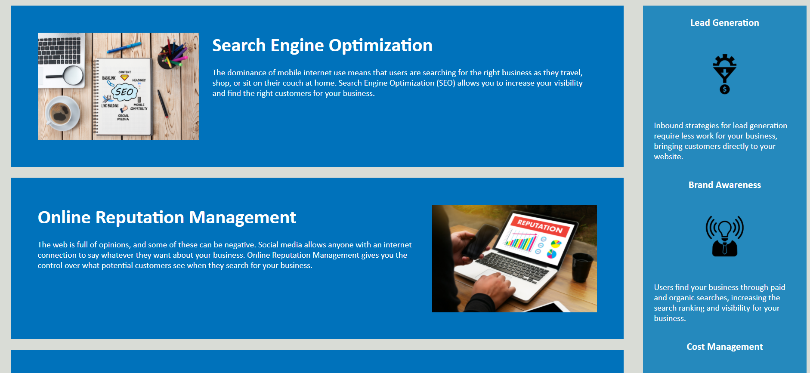

# <landing-page>

## Description

In this activity, we have to refactor existing code so that it follows the semantic structure of the HTML elements, accessibility standards, and has a clean stylesheet.

## Usage

   
   

Access deployed application here- https://fauziashafi.github.io/landing-page/
